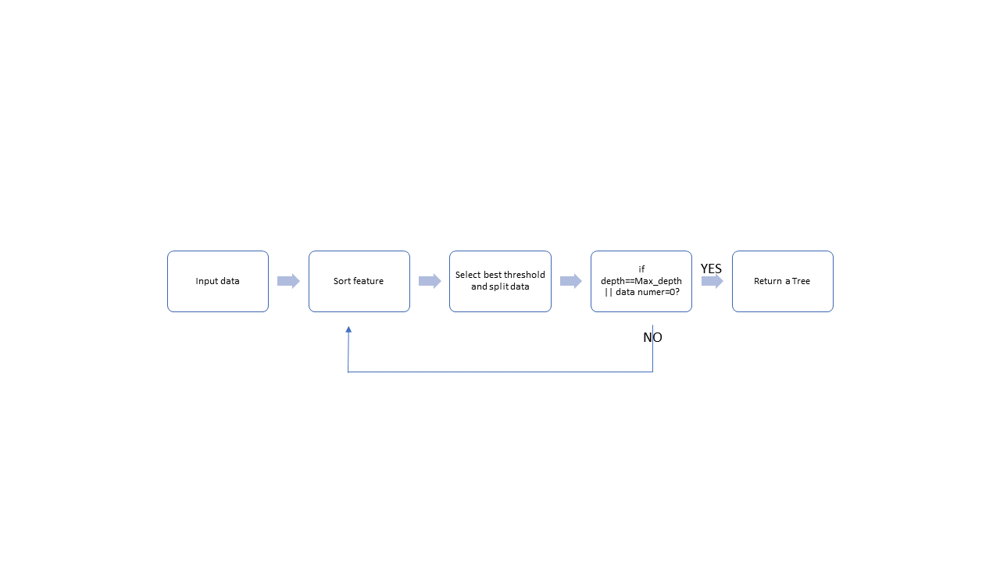

========================
Faster Decision Tree Build with C++
========================

Basic Information
========================
Code repository: https://github.com/09510/Encryption-Acceleration

Problem to solve
=======================
Decision tree is a good method for data analysis and feature analysis.
We usually want to build a large number of trees/forests to analyze various feature or to achieve higher accuracy.
However, there are a lot of data access in the process of building a tree/forest. (For example, keep accessing a 400*30 array to do sort operation and to select best threshold.)
This tool allows you to build a decision tree faster by C++.
I have hand-craved the the decision tree building with python in the past. So this project (c++ version) will be compared the speed with python version.

Perspective users 
=========================
Anyone who wants to build decision tree and faster decision tree building.

 
System architecture 
=============================

API description 
================================
Python Basic API : 
    1. Build_forest(forest_size , tree_depth , feature_num ,train_data) : Return forest.
    2. predict(test_data) : return predict result.
- forest : The forest build by training data.
- forest_size : tree number. Default 1.
- tree_depth : depth of each tree. Default -1, no limit.
- feature_num : the number of feature used .Default 0, using all feature. 

Engineering infrastructure 
=================================

-Build System : 
    Make
-Version Control : 
    Git
-Test : 
    C++ : Google Tesr
    
    Python : pytest

Schedule 
====================================
- Week 1: Implement decision tree class/algo. on C++
- Week 2: Implement decision tree class/algo. on C++
- Week 3: Implement decision forest class/algo. on C++
- Week 4: Implement decision forest class/algo. on C++
- Week 5: Compared the C++ version and python version
- Week 6: Test the system
- Week 7: Prepare presentation
- Week 8: Prepare presentation
