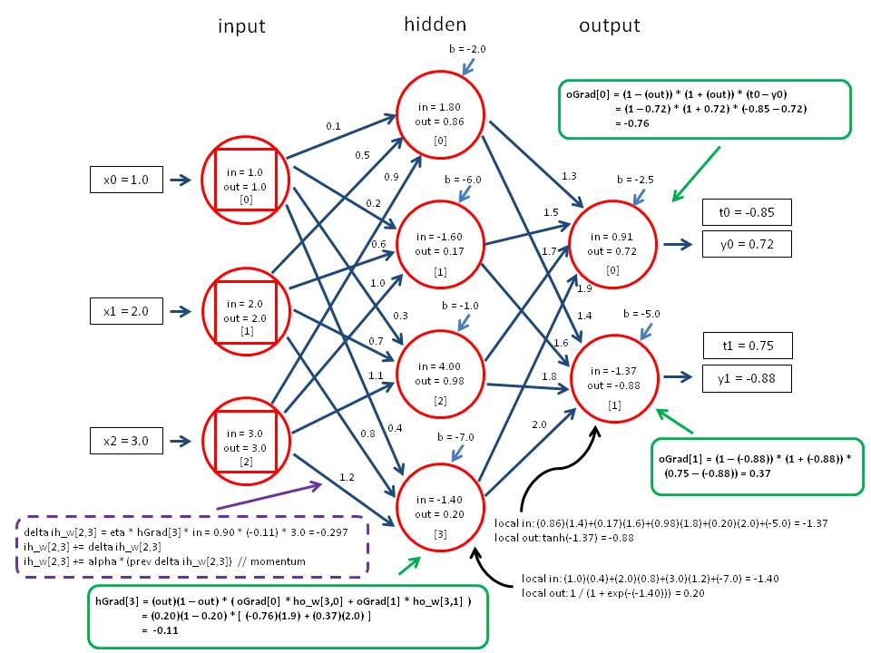

====================
Simple ML Framework
====================
---------------------------
B106Roger @2021 NSD autumn
---------------------------

Basic Information
==================
Project Github Link: https://github.com/B106Roger/nsdhw_21au

Problem to Solve
================
| In modern academic research related to neural network, computing overhead is always the main problem in this field.
| Therefore, to accelerate the computing speed, we often use GPU to parellelize our matrix multiplication operation.
| Recently, famous framework such as Pytorch and tensorflow handle all the GPU operation and provide 
| high-level API in Python, which result in most of AI researcher's novelty are limited by the framework.
| In order to know more about how GPU maipulate matrix in low-level API (C, C++), I would like to create my own 
| neural network framework, and use pybind to provide high-level API in python.

Prospective Users
=================
| Deep learning researcher who want to get more familiar with GPU can read the C++ code in this project.
| As for the main purpose of providing python high-level API is to make unit test much more esier and 
| practice using the pybind API.

System Architecture
===================
| - Provide easy-to-use API so that user can customize their neural network model(artribary number of layers, number of neurals)
| - Provide load weights and save weights functionality
| - Make sure our implementation of backprobagation is exactly same as the main stream deep learnning framework such as tensorflow or pytorch

API Description
===============

**Python API**:

This is a simple example:
::

    # The data are MNIST dataset
    # train_data=(60000, 784, 1), train_label=(60000, 1)
    train_data, train_label=load_train_data()
    layers=[
        Linear(16, 32),
        Linear(32, 64),
        Linear(64, 10)
    ]
    mode=Model(layers)
    loss_fn=CrossEntropy()
    opt=SGD()
    model.set_loss(loss_fn)
    model.set_optimizer(opt)
    for epoch in range(10):
        for batch in range(60):
            target_train=train_data[batch*1000:(batch+1)*1000]
            target_label=train_label[batch*1000:(batch+1)*1000]
            losses=model.train_step(target_train, target_label)

**C++ API**:

This is a simple C++ API interface:
::

    # Layer C++ Level API
    Layer::Layer()
    Layer::~Layer()
    Tensor Layer::forward(Tensor)
    Tensor Layer::backward(Tensor)

    # Model C++ Level API
    Model::Model(vector<Layer*>)
    Model::~Model()
    void Model::load_weights(Tensor)
    void Model::set_loss(Loss)
    void Model::set_optimizer(Optimizer)
    float Model::train_step(Tensor, Tensor)

    # Loss
    Loss::Loss()
    void Loss::set_weight(Tensor)
    Tensor Loss::forward()
    Tensor Loss::backward()

    # Optimizer
    Optimizer::Optimizer()
    void Optimizer::apply_gradient(Model, Tensor)

    # Tensor
    Tensor::Tensor()
    void Tensor::ones(**arg)
    void Tensor::ones_like(Tensor)
 

Engineering Infrastructure
==========================
**Build System**
install Nvidia CUDA Toolkit
make (includes make, make run, make clean, make test)

**Testing Tool**
Python: pytest, Tensorflow, Pytorch
tensorflow and pytorch are used to generate result of backprobagation.

**Version Control**
Git

Schedule
========

- Week 1: read cuda sample API code
- Week 2: basic memory transfer between CPU and GPU
- Week 3: matrix multiplication and addition
- Week 4: single layer backprobagation
- Week 5: multi layer backprobagation
- Week 6: loss function backprobagation and gradient descent algorithm
- Week 7: use pybind to provide Python interface 
- Week 8: prepare presentation