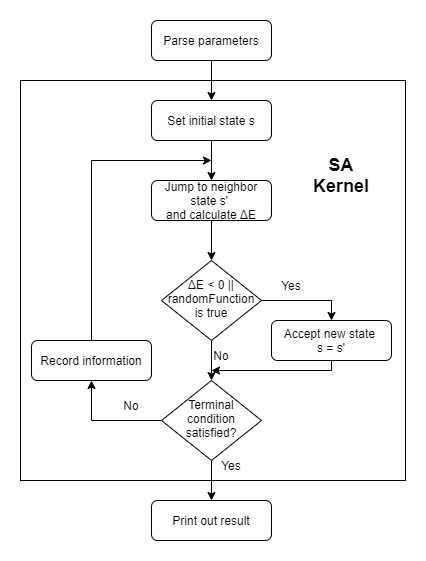

================================================
SAAF : a Simulated-Annealing Algorithm Framework
================================================

Basic information
=================
| SAAF is a user-friendly framework that helps users to develop a simulated-annealing based algorithm easily, and provides some related 
| function to show the execution result.

The GitHub repository : https://github.com/BlueBug12/SAAF

Problem to solve
=================
| In the computer science domain, there are plenty of problems that have been proved to be NP-complete. As we know, there is still no 
| polynomial-time algorithm to solve those problems efficiently. Therefore, heuristic algorithms become useful when we are dealing with
| them, and simulated-annealing( SA for short) is one of the well-known and effective heuristic algorithm. The name of the algorithm comes
| from annealing in metallurgy, a technique involving heating and cooling of a material to change its physical properties. The first step 
| is to heat up a material until it reaches an annealing temperature, then cool it down slowly in order to change the material to a desired
| structure. The "heat up and cool down" process is actually the key idea of SA algorithm. It provides a effective way to a approximate 
| solution to the global optimum in the search space, and avoid being trapped at the local minimum. Therefore it is very useful when we are
| dealing with some difficult computational otimization problems.

| However, it usually takes time to develop a simulated-annealing based algorithm. Sometimes, it is challenging to define a proper objec-
| tive function(we call it "energy state" in SA) to help us search the optimal solution, and there are a lot of combinations of parameters 
| that need to be tested. As a result, I want to develop a user-friendly SA framework which can help users to verify and evaluate their 
| idea in a short time. On the other hand, SA algorithm is usually time-consuming, so it's suitable to use hybrid architecture to implement
| it to strike a balance between flexibility and performance.

Perspective users
=================
* Software developers that need to quickly develop a prototype using SA-based algorithms. 
* Researchers who want to verify their preliminary ideas to solve the problem with SA-based algorithms.
* Students who want to practice and experience some SA-based algorithms. 

System architecture
===================
| Except the user-defined functions, basically all API call C++ packages to do numerical calculation in order to get the better performance.
| The framework provide a flexible user defined function to make sure it can satisfy different problem formulations and user requirements.

| After the algorithm terminate, user can choose how to show the calculation ressult(in terminal, text file or diagram).

API description
===============
.. code-block:: python
 
 setParam(descent_rate: float,  initial_t: float, final_t: float, scale: float, x_min: list, x_max: list, markov_iter: int) # set all the parameters needed by SA 

 setInitialState(state) # set the initial state

 runSA(); # start SA

 logger(period: int) # print out SA information

 acceptance(delta_erengy: float, temperature: float) # set the corresponding parameters for acceptance probability function

 resultOutput() # show the final result (on terminal)

 historyDiagram() # plot the SA history

 writeResult(file_name: str) # output the result to a file
 
 
 # ============================= User-defined: =============================
 getEnergy(state) # objective function, define the energy of current state

 neighbor(state) # jump to another neighbor state

 terminalCondition(*args, **kwargs) # set the terminal condition

Engineering infrastructure
==========================
* languages: 

	* C++11 
	* Python 3.9.5

* build system 

	* GNU Make

* testing framework

	* C++: GoogleTest
	* Python: pytest

* Version control

 	* git

Schedule
=================
* week1(10/25 - 10/31): build prototype code(only using Python)

	* design data structure
	* parameter parser
	* initial state setting
	* implement acceptance and randomRange function 

* week2(11/1  - 11/7 ):  build prototype code(only using Python)

	* design SA kernel 
	* example for user-defined function

* week3(11/8  - 11/14):  build prototype code(only using Python)

	* implement output functions
	* verify result

* week4(11/15 - 11/21): split and implement hybrid architecture 

	* define the C++ packages
	* implement all necessary function with C++

* week5(11/22 - 11/28): split and implement hybrid architecture 

	* implement all necessary function with C++

* week6(11/29 - 12/5 ): verify and test result
	
	* combine the whole architecture
	* use the framework to solve some NP-complete problem as demonstration

* week7(12/6  - 12/12):	verify and test result

	* use the framework to solve some NP-complete problem as demonstration
	* collect the experiment results

* week8(12/13 - 12/19): prepare presentation

