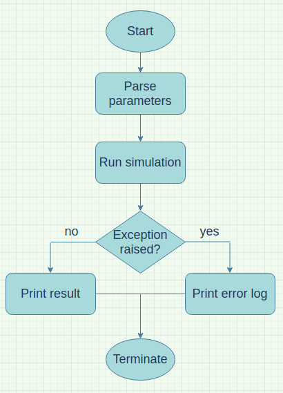

============================
NSD Term Project
============================

Basic Information
----------------------------
| Github repository url:
| `https://github.com/Eric860730/A-simple-virus-spread-simulation<https://github.com/Eric860730/A-simple-virus-spread-simulation>`

Problem to Solve
----------------------------
| In recent years, COVID-19 has been raging around the world.
| It has a great impact on everyone's lives.
| According to this article[1], the spread of COVID-19 is increasing exponentially.
| In order to prevent the spread of COVID-19, each country/region has implemented many policies (e.g. quarantine, restriction of in-store dining, lockdown...).
| These policies have produced different results in controlling the spread of COVID-19.

| I want to simulate the impact of different policies on the spread of pandemic viruses.
 User can adjust parameters(e.g. virus infection rate, virus mortality rate...) and policy to observe the final result.
 I will use animation to show the process of infection and print the distribution of the virus spread.
| Therefore, we can observe the difference in the distribution of infection under different policies.

Prospective Users
----------------------------
| Those who want to know if these policies help prevent the spread of COVID-19.
| Users can set different conditions, such as the total number of people, virus infection rate, death rate, and different policies.
| Then observe the distribution of the virus spread and the number of deaths.

System Architecture
----------------------------

Input
^^^^^^^^^^^^
* total number of people
* moving speed of people
* virus infection rate
* virus mortality rate
* recovery time
* choose policy (Free, Attempted quarantine, Moderate distancing, Extensive distancing)
* healthcare capacity (The mortality rate is halved.)

Output
^^^^^^^^^^^^
* Animation of the virus spreading process.
* The distribution graph of virus spread.
* The number of uninfected people.
* The number of recovered people.
* The number of death people.

System Components
^^^^^^^^^^^^^^^^^
1. Parser: Python class. Parse user input parameters for simulation.
2. Simulator: C++ class. Use input parameters to simulate the spread of the virus.
3. Printer: Python class. Print simulation results with animation.

System Workflow
^^^^^^^^^^^^^^^^^

Constraints
^^^^^^^^^^^^^^^^^
1. Users cannot add their own policies.
2. Cannot simulate the spread of virus between countries. (For example, different regions use different policies to observe the results of the spread of the virus.)
3. Cannot simulate the real situation of people moving. (Most people move regularly in daily life, but the movement of people is random during the simulation process.)
4. Cannot see the death rate of each age. (I did not consider the age of the person in the simulation. If there is enough time, I will try to finish it.)

API Description
----------------------------
1. Parser:
   getParameters(): Returns parsed parameters.

2. Simulator:
   simulateVirusSpread(parameters: parser's results): According to the user's input, the spread of the virus is simulated.

3. Printer:
   printSpreadProcess(): Use animation to print the virus spreading process.
   printSpreadDistribution(): Print the distribution graph of virus spread.
   printConclusion(): Print the number of uninfected people, recovered people and death people.

Engineering Infrastructure
----------------------------

Build System
^^^^^^^^^^^^^^^^^^
make

Testing Framework
^^^^^^^^^^^^^^^^^^
Python: pytest
C++: Google test
According to this article[1], these policies should show the following distribution(under same situation):
1. Free: exponential curve (smallest variance)
2. Attempted quarantine: flatten curve than Free (the second smallest variance)
3. Moderate distancing: flatten curve than Attempted quarantine (the third smallest variance)
4. Extensive distancing: flatten curve than Moderate distancing (largest variance)

Version control
^^^^^^^^^^^^^^^^^^
git

Schedule
----------------------------
* Week 1: Parser, Simulator
* Week 2: Simulator(policy: Free)
* Week 3: Simulator(policy: Attempted quarantine)
* Week 4: Simulator(policy: Moderate distancing)
* Week 5: Simulator(policy: Extensive distancing)
* Week 6: Printer
* Week 7: Flexible time(Add death rate of each age)
* Week 8: Flexible time(Add death rate of each age)

References
----------------------------
| [1]: Why outbreaks like coronavirus spread exponentially, and how to “flatten the curve”<https://www.washingtonpost.com/graphics/2020/world/corona-simulator/>
| [2]: <https://github.com/paulvangentcom/python_corona_simulation>
