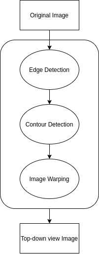
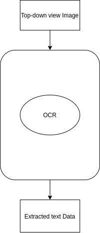

Basic information
=================

Project link:
-------------
https://github.com/Hydr8O/nsd-project

Problem to solve
================

Problem Description
-------------------
Many companies in various industries store data about different procedures in a structured way for future use.

However, there are a big chunk of unstructured data in the form of paper documents that is needed to be converted into structured format manually.

The goal of this project is to automate manual data retrieval from the paper sources.

Methods Description
-------------------

To achieve the goal of the project, the whole procedure divided into two major sequential stages:

1. Image pre-processing.

   The main target of this stage is to get a top-down view of a document being processed which is achieved by following the pipeline:

 1. Edge detection - getting image edges.
 
 2. Contour detection - detecting contours based on the edges.
 3. Image warping - warping an image to get the top-down view for the text retrieval.

2. Textual data retrieval.
 
 The main instrument used for extracting text data from an image is OCR. 

Prospective Users
-----------------
Anyone who is in need for converting unstructured paper document data into a structured format (a company to track its own data, a data scientist wanting to get data from a document, etc.)

System Architecture
===================

Overall Workflow
----------------
Image preprocessing:

Text data extraction:

API Description
===============

Engineering Infrastructure
==========================

Schedule
========

* Week 1
 

* Week 2

* Week 3
 

* Week 4
 

* Week 5

* Week 6

* Week 7

 
* Week 8

References
==========