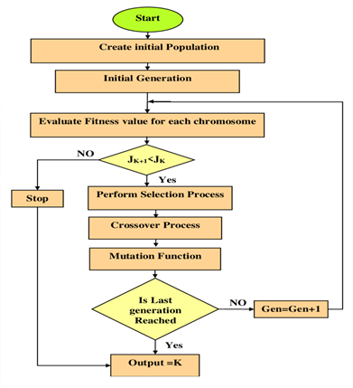
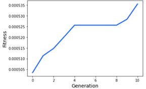
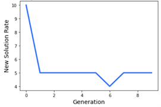
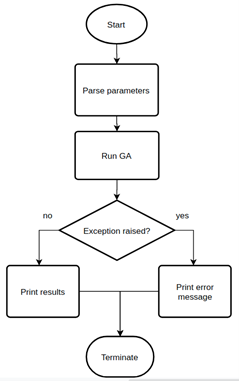

Basic Information
=================
https://github.com/LittleLaGi/OhMyGene

Problem to Solve
================
| Multi-objective formulations are realistic models for many complex engineering optimization problems.
| Objectives under consideration usually conflict with each other. Possible solutions form a Pareto set.
| A Pareto optimal set is a set of solutions that are non-dominated with respect to each other. We can use multi-objective GA to get a set representing the Pareto optimal set well.
|
| GA is inspired by evolutionary theory. In GA terminology, a solution vector is called an individual or a chromosome, which normally corresponds to a unique solution x in the solution space.
| GA operates with a collection of chromosomes, called a population.
| The population is normally randomly initialized. As the search evolves, the population includes fitter solutions, and eventually, it converges.
|
| This proposal proposes a project named Oh My Gene(OMG), which provides a high-level Python API to construct GA to solve multi-objective problems.
|
| Below is a diagram of GA’s general flow:
|

Prospective Users
=================
| OMG targets users who need to solve multi-objective problems in specific fields. Users have to map the solution spaces of the problems into forms of chromosomes supported by OMG.
|
| After the encoding of a problem, the general GA  can be adapted to solve the transformed problem by tuning some parameters. E.g., generation number, mutation probability, fitness function choice, parent selection method, cross-over method, mutation method, etc.
| After the selection of parameters, OMG automatically creates an object of GA and runs it. The result will be shown on the screen for inspection after GA stops.
|
| Users can try out different parameter combinations to get the best version of GA that fits their needs by simply altering a few lines of Python code, OMG!

System Architecture
===================
| **Tunable Parameters**
| 1. generation number (default = 100)
| 2. mating parent ratio (default = 0.5)
| 3. mutation probability (default = 0.01)
| 4. fitness function choice (default = weighted sum)
| 5. parent selection method (default = random selection)
| 6. cross over method (default = single point crossover)
| 7. mutation method (default = random mutation)
|
| **Output**
| 1. last population: Show top individuals in the last population.
| 2. fitness diagram

| 3. new solution rate diagram

|
| **System Components**
| 1. **Parser**: Python class. Checks the validity of input parameters and performs necessary transformations.
| 2. **GA Wrapper**: Python class. Wrapper class for underlying C++ GA class.
| 3. **Result**: Python class. Contain results returned from GA wrapper.
| 4. **Printer**: Python class initialized with Result. Responsible for printing the results in specified forms.
| 5. **GA**: C++ class. Perform GA configured with parameters processed by parseParams.
|	
| **System Workflow**

|
| **Assumptions & Constraints**
| 1. OMG supports a double vector for gene representation.
| 2. Some parameter choices make implicit assumptions. E.g., Roulette Wheel Selection and Stochastic Universal Sampling require fitness to be a positive value. Failure to meet the requirements may cause exceptions.
| 3. OMG provides limited parameter choices, which may not be able to model a real-world problem properly.
|
API Description
===============
| **API for Parser class**
| 1. __init__(params: dict):  Get the parameters from the user,  checks the validity, and perform necessary transformations. Raise exceptions if any check fails.
| 2. getParams() -> params: dict: returns parsed parameters.
|
| **API for Printer class**
| 1. __init__(result: Result)
| 2. printTopNum(num: int): print out the top num individuals in last population.
| 3. printTopPercent(percent: float): print out the top individuals  in last population.
| 4. printFitness(): print out the fitness diagram.
| 5. printNewSolutionRate(): print out the new solution rate diagram.
|
| **API for GA Wrapper class**
| 1. __init__( params: dict): Create an instance of GA class with parameters provided by Parser class.
| 2. run() -> result: Result: Perform GA. May raise exceptions.

Engineering Infrastructure
==========================
| **Build System**
| make
|
| **Testing Framework**
| Python: pytest
| C++: Google test
|
| **Version Control**
| git
|
| **Description**
|  The Makefile contains commands to build C++ programs and run OMG along with several unit tests automatically. As for version control, there will be several branches:
| **main**: Tested, deployable version.
| **fitness_function**: Choices for fitness function.
| **parent_selection**: Choices for parent selection method.
| **crossover**: Choices for cross-over method.
| **mutation**: Choices for mutation method.
| **general_workflow**: Code related to remaining functionality, includes Parser and Printer.

Schedule
========
| ● Week 1: Parser, Result, and Printer.
| ● Week 2: General GA implemented with trivial methods.
| ● Week 3: More fitness function choices.
| ● Week 4: More parent selection function choices.
| ● Week 5: More parent selection function choices.
| ● Week 6: More crossover function choices.
| ● Week 7: More crossover function choices.
| ● Week 8: More mutation function choices.

References
==========
| [1] https://www.eng.auburn.edu/~aesmith/files/Multi-objective%20optimization%20using%20genetic%20algorithms.pdf
| [2] https://github.com/ahmedfgad/GeneticAlgorithmPython
| [3] https://www.researchgate.net/figure/General-flow-chart-for-GA_fig1_337199672
| [4] https://pybind11.readthedocs.io/en/stable/classes.html

