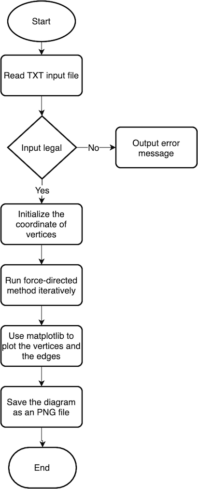

===================
Graph Visualization
===================

Basic Information
=================

- GitHub repository: https://github.com/Luke2336/graph-visualization

Problem to Solve
================

1. Visualizing a graph can help people study graph theory. In this project, I would like to use force-directed method (Fruchterman-Reingold Algorithm) to layout a simple undirected graph to let the number of edge intersections as small as possible.
2. Vertex placement is a practical problem, and force-directed method is also used in VLSI placement.

Prospective Users
=================

The prospective users are poeple who want to visualize a graph.

System Architecture
===================

- Algorithm
   - This algorithm is based on force-directed method.
   - Force Model
      - k = C * sqrt(area / n), C is a constant found experimentally
      - d is the distance between two nodes
      - Attractive forces: fa(d) = d^2 / k
         - If vertex A is incident to vertex B, there is an attractive between A and B.
      - Repulsive forces: fr(d) = -k^2 / d
   - For each iteration, it will spend O(n^2) time adjusting the forces and the positions of vertices.
   - I would like to adjust the positions of vertices for 1000 iterations.
- Flow chart

API Description
===============

``drawGraph('input.txt', 'output.txt', 'output.png')``

- Input format
   - The first line contains two non-negative integers n and m. (n <= 1000)
   - For 2 ~ m + 1 lines, there are two integer a and b, which means there is an edge between vertex a and b.
- Output format
   - There are n lines.
   - Each line contains a 2D integer coordinate of the vertex i.

Engineering Infrastructure
==========================

- Build System: Make
- Version Control: Git
- Test: GoogleTest / Pytest
   - Segments should not be overlapping.
      - Since the coordinates are all integer, we can do segment-overlapped test in O(m log m).
   - Graph using for testing:
      - Complete graphs
      - Petersen graph
      - Trees
      - Grids
      - Some planar graphs

Schedule
========

- Week 1: [Python] Transfer the coordinate into PNG
- Week 2: [C++] Implement forced-directed method
- Week 3: [C++] Implement forced-directed method & [Makefile]
- Week 4: [C++] Implement forced-directed method
- Week 5: Integrate the c++ and python code
- Week 6: [Python] Test the result of algorithm
- Week 7: Prepare presentation
- Week 8: Prepare presentation

References
==========

- https://dcc.fceia.unr.edu.ar/sites/default/files/uploads/materias/fruchterman.pdf
- https://i11www.iti.kit.edu/_media/teaching/winter2016/graphvis/graphvis-ws16-v6.pdf