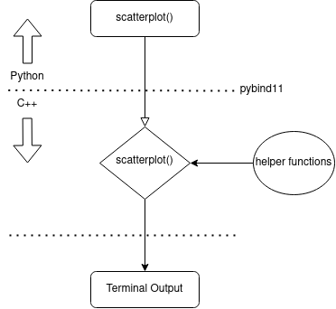

# TermPlot (terminal plotting library)

## Basic Information
Github repository: [TermPlot](https://github.com/hsjts0u/TermPlot)

## Problem to solve
Data science and machine learning have become very popular in this day and age, making data visualization an important topic. However, data visualization is quite difficult when there is no access to gui interfaces. There may be times when the user only has access to a terminal (like connecting to a remote server over ssh), which makes data visualization difficult. The user may choose to export the generated graphs, then download the graphs to a local machine with a gui interface, then view the results. These steps are quite redundant, and may be avoided using a terminal graphing library, which is the aim of this project.

## Prospective Users
Prospective users are those that need data visualization on their terminal for convenience sake, which may include, but not limited to data scientists, machine learning practitionists, and python users.

## System Architecture

### Implementation Detail

#### User Facing Function
* **scatterplot(height, width, xmin, xmax, ymin, ymax, x, y, graphoptions)**
    * height: height of plot
    * width: width of plot
    * xmin: lower bound of x-axis
    * xmax: upper bound of x-axis
    * ymin: lower bound of y-axis
    * ymax: upper bound of y-axis
    * x: array-like of x coordinates 
    * y: array-like of y coordinates
    * graphoptions: tuple of graph styling options

#### C++ Inner Working Function
* **scatterplot(size_t height, size_t width, long double xmin, long double xmax, long double ymin, long double ymax, T \*x, T \*y, struct graphoptions)**
    * each argument corresponds to the python arguments with respect to position
    * T is the generic numeric typename under template\<typename T\>

The **python scatterplot()** will be bound to **C++ scatterplot()** using pybind11 as the binding tool.

### Flow Diagram

## API Description
From python, the user can call **scatterplot(height , width, xmin, xmax, ymin, ymax, x, y, graphoptions)** to generate a scatter plot in the terminal.

If time allows, more plots may be implemented, for example bar plots, pie charts, box plots, etc.

## Engineering Infrastructure

<ul>
<li> Build System </li>
    <ul>
        <li> make </li>
        <li> make clean </li>
        <li> make test </li>
    </ul>
<li> Testing Framework </li>
    <ul>
        <li> C++: Google Test </li>
        <li> Python: pytest </li>
    </ul>
<li> Version Control </li>
    <ul>
        <li> Git </li>
    </ul>
</ul>

## Schedule
Week | To-Do
----:|--------
1    | Study other repositories and begin coding basic components in C++
2    | Implement graph utilities
3    | Implement graph renderer
4    | Finish C++/Bind to python
5    | Bind to python
6    | Component testing
7    | Finish up, debug, and write documentation
8    | Make slides and prepare for presentation

## References
1. [C++ terminal plotting library](https://github.com/fbbdev/plot)
2. [C++ Tables and Graphs in a terminal](https://github.com/tdulcet/Tables-and-Graphs)