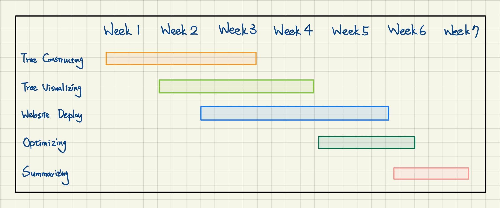

===================
Dynamic Visualization Tool of Red-Black Tree
===================

GitHub repository
===================
- https://github.com/jonathan-liu-0204/Visualization-of-Red-Black-Tree

Problem to Solve
===================
When studying data structure, the Red-Black Tree problem is the most common problem to most students, without a doubt.
The main reason that confuses is usually the lack of visualization tools. 
Besides, Red-Black Tree is generally the one that caused the most confusion. 
Hence, I would like to build a dynamic visualization tool for Red-Black Tree.

Perspective users
===================
Anyone making their effort learning data structure.

System architecture
===================

-------------------
Backend
-------------------

- To ensure the tree user input is visualized properly, I must have a flawless Red-Black Tree constructed in the backend.

- The tree should strictly follow the following rules:
    - Every node has a colour either red or black.
    - The root of the tree is always black.
    - There are no two adjacent red nodes (A red node cannot have a red parent or red child).
    - Every path from a node (including root) to any of its descendants NULL nodes has the same number of black nodes.

-------------------
Frontend
-------------------

- Since I want all the people learning data structure can use this visualizing tool, I'll deploy this on my own website.

- User Interface

  - Although there's actually a few tree visualization tool in the community, in my opinion, most of them are not such user friendly. Hence, aiming to make Red-Black Tree easier to understand, User Interface will probably be a big part that I'll focus on.

API description
===================

User can build up the tree by the user interface of the website.
After receiving user's requests, the backend will construct the tree.
Whenever a node of the tree is constructed, backend will visualize and display it in the frontend simultaneously.

Engineering infrastructure
===================

Tree constructing: C++

Tree visualizing: Python

Frontend website 
- Platform: WordPress
    - FREE.
    - Highly customizable and user-friendly.
    - Being "responsive", which mean it’ll also work on smartphones & tablets.
    - Help available from the community

Schedule
===================

Reference 
===================
- https://en.wikipedia.org/wiki/Red%E2%80%93black_tree
