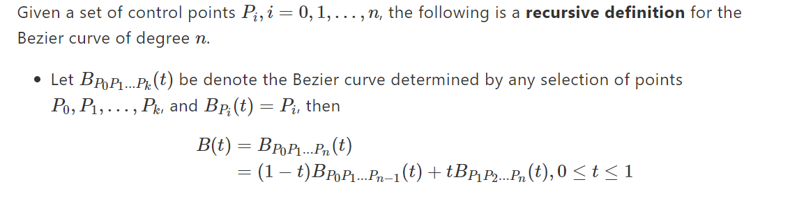
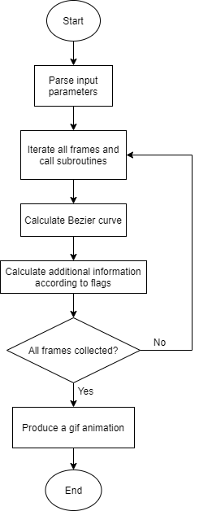

# Exploring Bezier Curve

## Basic Information
GitHub repository: https://github.com/nctu16028/Exploring-Bezier-Curve

## Problem to Solve
A **Bezier curve** is a parametric curve that is widely used in computer graphics and related fields.

An algorithm called **De Casteljau's algorithm** calculates Bezier curves using this definition.

In this project, I am going to build a system that receives some two-dimensional points and then presents the formation of Bezier curve in animation. Besides, the users can decide whether to show additional information of the curves. For example, tangent, curvature, or bounding box, etc.

## Prospective Users
1. Beginners of numerical analysis or computer graphics
2. Anyone simply appreciating the beauty of Bezier curves

## System Architecture

## API Description
**Python**
- `main()`: parse input parameters, including order, coordinates, and flags of showing additional information
- `draw_animation()`: call subroutines and then consolidate the results to produce a gif animation

**C++**
- `draw_curve()`: calculate the coordinates of curve points at a given time frame
- `draw_tangent()`: calculate the first-order derivative at a given time frame
- `draw_curvature()`: calculate the curvature (maybe with the osculating circle) at a given time frame
- `draw_bounding_box()`: calculate the boundaries of four sides at a given time frame

## Engineering Infrastructure
- **Build system**: make
- **Testing framework**: GoogleTest(C++), pytest(Python)
- **Version control**: Git

## Schedule
- Week 1 (10/31-11/06):
    - Build a rough structure
- Week 2 (11/07-11/13):
    - Implement De Casteljau’s algorithm for curve points
- Week 3 (11/14-11/20):
    - Implement the derivatives calculation of the curve
- Week 4 (11/21-11/27): 
    - Implement the tanget and curvature calculations
- Week 5 (11/28-12/04):
    - Implement the bounding box calculation
- Week 6 (12/05-12/11):
    - Implement the animation generating module
- Week 7 (12/12-12/18):
    - Optimization or maybe adding more features
- Week 8 (12/19-12/25):
    - Prepare presentation 

## References
1. https://en.wikipedia.org/wiki/B%C3%A9zier_curve
2. https://pages.mtu.edu/~shene/COURSES/cs3621/NOTES/spline/Bezier/de-casteljau.html