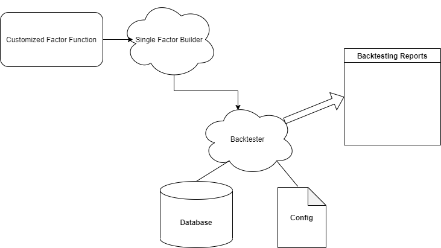

# Backtesting framework for trading strategy

## Basic Information
In quant trading, [backtesting](https://www.investopedia.com/terms/b/backtesting.asp) is the general method to assess the viability of a given strategy. It uses historical data to simulate the trading strategy and then generates a quantitative report.

Github repository: [Link](https://github.com/sam29309010/Backtesting-framework-for-trading-strategy)

## Problem to Solve
Analysts use backtesting as a way to test and compare various trading techniques without risking money. The theory is that if their strategy performed poorly in the past, it is unlikely to perform well in the future (and vice versa). Hence given a strategy, a typical backtesting process will use historical data to automatically simulate a series of fake transactions, and finally return some index (e.g. net profit, market exposure, volatility) to evaluate the performance of the trading stategy.

Numerous open-source backtesting systems such as [Backtrader](https://www.backtrader.com/), [QSTrader](https://github.com/mhallsmoore/qstrader) and [backtesting.py](https://kernc.github.io/backtesting.py/) have been proposed and well-maintained by developers. They offer a very user-friendly interface that allows users to focus on the implementation of the strategy itself, and the whole structure of them is mostly written in python. The project aims to realize a simple version of backtesting framework, with similar basic functions but faster performance. Considering the diversity of trading strategies and the scope of framework implementation, the project will mainly focus on [Long-Short Strategy](https://www.investopedia.com/terms/l/long-shortequity.asp) and try to optimize its low-level implementation. Long-Short Strategy, also called pair trade, is a very common trading method used in quant market. It takes long positions in stocks that are expected to appreciate and short positions in stocks that are expected to decline. Our goal is to reduce the simulation time of its realization in this project, so that more factors could be tested when we apply them in real-time trading.

## Perspective Users
Those who are interested in trading simulation engine for research or business purposes.

## System Architecture

## API Description
| Name | Inputs  | Returns  | Description  |
| ---- | ------------ | ------------ | ------------ |
| Backtester  |  single_factor_name, time_interval, strategy_mode | trade_reports  | Construct trade reports based on specific single factor. Some user config (e.g. database path & benchmark) should be set first  |
| SingleFactorBuilder  |  predefined_factor_function  | factor_values_csv  | Construct single factor values using given function. |
| TestEngine  |  position, trad_limit ,benchmark_returns, strategy_info etc.  | daily_trade_result  | Construct single factor values using given function. |

## Engineer Infrastructure
- Build system: make
- Test framework:
  - Python: Pytest
  - C++: GoogleTest
- Version control: git & Github

## Schedule
| Week | Schedule  |
| ------------ | ------------ |
| 1  | study code & review domain knowledge  |
| 2  | implementation of basic framework  |
| 3  | unit test for `Backtester` & `SingleFactorBuilder` |
| 4  | implementation of `TestEngine`  |
| 5  | unit test for `TestEngine` |
| 6  | minor improvement & bug fixes  |
| 7  | preparing presentation |