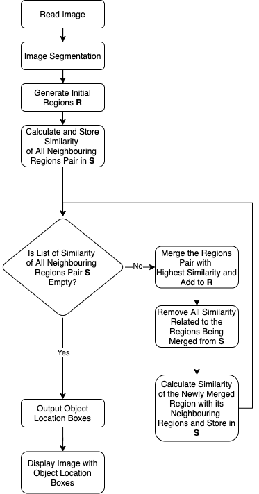

C++ Selective Search
===========================
## Basic Information

**Github repository**: https://github.com/whtang906/cpp-selective-search

## Problem to Solve
Selective Search is one of the typical region proposal algorithms used in object detection introduced in 2012. It firstly initializes regions by Efficient Graph-Based Image Segmentation. Then it computes hierarchical grouping of similar regions based on color, texture, size and shape compatibility. The algorithm can be used to find regions of an image that could contain an object.
The main purpose is to provide an efficient high-level API of Selective Search.
Another purpose of this project is to get familiar with the implementation of Computer Vision in C++ and earn experience in implementing an algorithm published in papers.

## Prospective Users
People who are going to implement object detection with Selective Search or curious about the implementation detail of Selective Search.

## System Architecture

## API Description
### Python
- readImage()
- displayImageWithLocationBoxes()

### C++
- imageSegmentation()
- selectiveSearch()
  - calculateFinalSimilarity()
    - CalculateColorSimiliarity()
    - CalculateTextureSimilarity()
    - calculateSizeSimilarity()
    - calculateShapeCompatibility()
  - mergeRegions()
    - isRegionsIntersecting()

## Engineering Infrastructure
**Testing Framework:** Pytest

**Version Control:** Git

## Schedule

| Week | Schedule |
| ------------- | ------------- |
| Week 1  | 1. Environment Setup 2. Be Familiar with Algorithm Detail |
| Week 2  | Declare All Header Files and Function Structure |
| Week 3  | Implement Image Segmentation |
| Week 4  | Implement All Region Operations |
| Week 5  | Implement All Similarity Calculations |
| Week 6  | Implement All Python-related Functions |
| Week 7  | 1. Test and Fine Tune  2. Prepare Powerpoint |
| Week 8  | Rehersal Presentation |

## References
1. [Selective Search for Object Recognition] https://www.researchgate.net/publication/262270555_Selective_Search_for_Object_Recognition
2. [Efficient Graph-Based Image Segmentation] http://people.cs.uchicago.edu/~pff/papers/seg-ijcv.pdf

